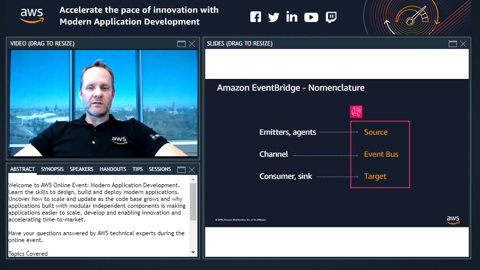
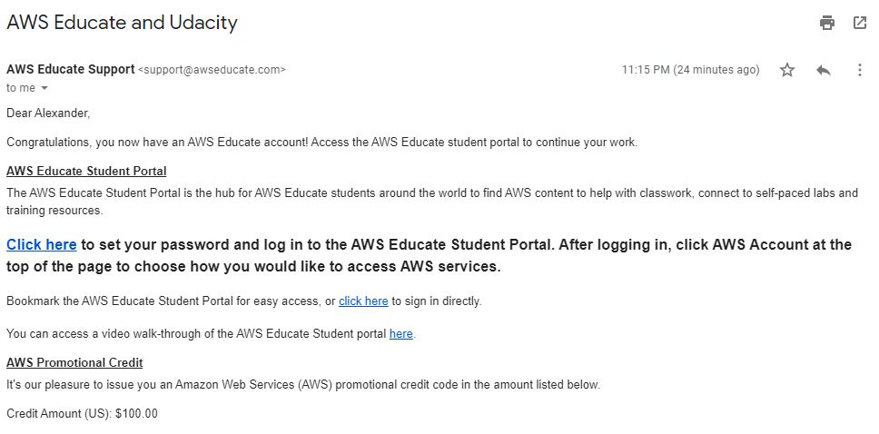

Day 23:
----------
Milestones:
1. I finally finished training the whole project in the Udacity workspace. I had problems with their autosave feature (some of my edits are unsaved due to sync errors that I had to reload the page). I got 25% accuracy on my own CNN implementation and 64 percent on transfer learning with just 5 epoch. They are not high accuracies due to my decision of decreasing the number of epochs to speed up the training process while following the rubric/requirements.
2. Started deep learning for cancer detection. It is interesting that transfer learning using pretrained model trained on non-medical dataset helped in detecting subtle nuances of benign and malignant skin cancer datasets. 

&#35;30DaysofUdacity

Day 22:
----------
Milestones:
1. With only 20 epochs of training, I managed to improve my CNN model from 3% to 15%. Validation loss still decreases significantly so I probably would train it more tommorrow.
2. Finished the transfer learning part of the project to which I will also train tomorrow.
3. Initially created the pipeline for the dog breed production algorithm. 

I am really excited to see app results tomorrow. Hopefully everything goes well that I can submit it for review. 

&#35;30DaysofUdacity

Day 21:
----------
Milestones:
1. Implemented the second optional exercise of the dog breed classifier project. I used ResNet50. It is not as straightforward like VGG19 (i.e. model returns constant output) but I fixed most of it by declaring model evaluation mode before the feed forward process. Resnet50 got 100% accuracy for both cases compare to VGG19 which missed one image from the human files.
2. Finally, I finished creating CNN model from scratch and initially train it. Got only 3% test accuracy since I ran the training for only 2 epochs. Will train it more tomorrow. 

Hopefully, I could finish the whole project very soon. 

&#35;30DaysofUdacity

Day 20:
----------
Milestones:
1. Finished the notebook for style transfer. 
2. Finished the first two exercises of the Dog Breed Classifier project which involves assessing the human face detector as well as implementing one without using opencv. I tried to use scikit-image package but it does not work on my machine as well as Udacity's workspace. Luckily, dlib, which is a package, originally written in C that contains machine learning algorithms including face detection. To make things even better, it surpasses opencv's face detection from a 17% error rate to just 8% (accounting for humans detected in dogs image so technically a false positive rate). It is also pretty consistent with its result so I am investigating now the images that are flagged humans and see if those images actually have humans in them. 

&#35;30DaysofUdacity

Day 19:
----------
Milestones:
1. Finished the whole Autoencoders lesson including all of the remaining notebook exercises. I naively forgot to implement migrating models and data to cuda for training. I spent around 30 minutes per epoch in convolutional autoencoder that I stopped the training and figured out what caused the problem. Spent few hours with GPU mode enabled to tweak the solution leveraging cuda. Nevertheless, that is a problem worth having. It really reinforced my understanding of GPU training with PyTorch.
2. Finished the theory part of the Style Transfer lesson. As of this writing, I am implementing solutions to exercises while reading the originating paper for solution. 

I am really excited to jumpstart my second project. I am hoping that I could finish that early.

&#35;30DaysofUdacity

Day 18:
----------
Milestones:
1. Successfully implemented the first notebook exercise for the Autoencoders lesson and got a pretty good performance. I constructed a model of three 6 layers for both encoder and decoder. It is a pretty slow training (took me around 25 minutes) but got a relatively good training loss (0.15 compare to Cezanne's 0.24). It was a fun exercise and as of this writing, I am continuing the lesson. Looking forward to Autoencoders with CNNs and how it performs compare to MLP.
2. Yesterday, me and my colleagues attended the AWS online event entitled Modern Application Development. This topic really resonates with our department's goals since we are used to monolithic development. Business these days are migrating to microservice framework right now especially in enterprice systems with varying compute requirements. Orchestrating each of the services in the microservice framework is a challenge but AWS's FaaS, SaaS and IaaS offerings really decouples these considerations from actual development. I am excited to migrate our projects to the aforesaid framework very soon. 

&#35;30DaysofUdacity

Day 17:
----------
1. Finished Lesson 4: Weight Initialization. I answered the reflection part poorly (sorry :D) but I learned that backpropagation does not deal with consistency but rather deals on how it rectifies the network (i.e. weights) from randomness of initial weights.
2. Started autoencoders lesson. As of this writing, I am implementing the first notebook exercise. I hope that I could finish the whole lesson tomorrow.

&#35;30DaysofUdacity

Day 16:
----------
1. Finished Lesson 3: Transfer Learning.
2. Explored and implemented the transfer learning exercise. I got 79 percent accuracy, slightly better than Cezanne's solution due to the increase in the number of epochs (5 instead of 2) in this case. CPU instance take a lot to train even with freezed weights, 15 minutes to a little over 2 minutes difference from CPU to GPU respectively.
3. Started the Weight Initialization lesson. 

&#35;30DaysofUdacity

Day 15:
----------
Milestones:
1. Finished my own implementation of the CIFAR-10 classification exercise with 67 percent accuracy. Not 71 percent as Cezanne got but the task really reinforced my knowledge of this topic. 
2. I recently got accepted in the AWS Educate application. It was approved only minutes after I signed up. I am pretty excited to run my models on provisioned and dedicated servers soon.

3. Started transfer learning lesson.

&#35;30DaysofUdacity

Day 14:
----------
Milestones:
1. Read Capsule Networks from Cezanne Camacho's [blog post](https://cezannec.github.io/Capsule_Networks/). In a nutshell, capsule networks are another configurations of CNNs to detect hierarchically-related features as well as preserve properties/features related to these hierarchies such as width, orientation, color, etc.
2. Perused Andrej Karpathy's explanation of [Convolutional Neural Networks](http://cs231n.github.io/convolutional-networks/#conv) specifically on how we can estimate parameters given the input, channels, expected number of kernels, stride and padding as well as the effect of pooling layers. This is a long read that I probably need to re-read this. 

I am currently implementing the CIFAR image classification exercise as added module of the CNN lesson and I am now in specifying model parameters. Will continue this tomorrow.

&#35;30DaysofUdacity

Day 13:
----------
Milestone:

Reviewed the Convolutional Neural Networks lesson. I had taken this lesson from Intro to Deep Learning with PyTorch free course but it is really nice to revisit the lesson again.

&#35;30DaysofUdacity

Day 12:
----------
Milestone:

Finished reviewing the sentiment analysis lesson and gearing up towards convolutional neural networks since I already finished the Deep Learning with PyTorch lesson. 

&#35;30DaysofUdacity

Day 11:
----------
Milestones:

1. Reviewed sentiment analysis lesson to reinforce the concepts of optimization and efficiency in training by dissecting the train and run functions. I probably need another day to finish reviewing the lesson. 
2. This is slightly related to deep learning that I needed sharing. I watched the [Full Frontal Rewind: The Best of Big Tech At Its Worst | Full Frontal on TBS](https://www.youtube.com/watch?v=C8AxAvh3-ck) with Samantha Bee. Bee jokingly featured deepfakes and facebook privacy fiascos since its inception and it made me realize the vast responsibility of AI enthusiasts and practitioners to prevent malicious use of AI and protect people's privacy. There is more to it so I would like you to check it out.

&#35;30DaysofUdacity

Day 10:
----------
Milestones: 

Finished Mini Projects 4, 5, and 6 of the Sentiment Analysis lesson.

Realizations: 

The lessons from the neural network stress the importance of understanding gradient descent and backpropagation in its fundamentality. Even Andrej Karpathy believes that is true. This lesson takes a notch to make me appreciate this truth even more. By creating a deep learning solution that is so verbose, you can observe patterns to convergence and speed and rectify them immediately with basic yet powerful tool - numpy. Although this touches the very basic neural network with easily computed gradients and errors, that is not the ultimate goal of this lesson. Its goal is to appreciate formulating solutions from the problems encountered from the results of initial attempts and build up from them, which I believe is the art of problem-solving in deep learning.

&#35;30DaysofUdacity

Day 9:
----------
Milestones:
1. Finished mini projects 2 and 3 of the sentiment analysis lesson. They are a bit tricky especially that I used comprehensions most of the time but it is a good practice for more comprehensions to come.

It has been two days since I started the sentiment analysis module and I appreciate the progression of forming an efficient solution to a particular problem. I am a bit slow but #30DaysofUdacity keeps motivating me. I hope you guys too.

&#35;30DaysofUdacity

Day 8:
----------
Milestones:
1. Finished Project 1 of the Sentiment Analysis lesson. It really is challenging when you are not looking at an already-made solution.
2. Learned that Counter package let's you count words easily and efficiently using few lines of code. I learned how to use Counter().update(), deviating from Trask's solution a little bit. I observed that it becomes tricky when you repeatedly update the Counter object since the update method does not exactly replace the previous value of each item in the dictionary, they are being augmented by the new values computed. But update method is proven useful for me in this case. 
3. I also refreshed my memory a little bit about dictionary comprehensions and map function. It really is become useful to make Trask's already few lines of code fewer. 

&#35;30DaysofUdacity

Day 7:
----------
This is my first week in the nanodegree and it has been a rewarding experience by far.
Milestones:
1. Finished, submitted and passed the first project Predicting Bike-Sharing Data. I got a training loss of 0.071 and validation of 0.155. I am now awaiting for code review.

2. Watched the history of [AI and Deep Learning](https://www.youtube.com/watch?v=ht6fLrar91U) visual podcast by Frank Chen where he explained how AI visions became fruitful on the present years from the summer of 1952, to AI winters, to breakthroughs in deep learning to the advances in Machine Learning products that we enjoy right now. I am glad that I watched this video. It feels like I am heading into the right direction of investing my time and efforts to learn this domain to produce systems enhanced with AI components. 

&#35;30DaysofUdacity

Day 6:
----------
Milestones:
1. Finally, I finished the Implementing Gradient Descent lesson. It is so much fun. This really reinforces the value of theoretical/mathematical intuition as before utilizing much more complicated deep learning methods. I probably need to review this again.
2. Watched Andrej Karpathy's [lecture](https://www.youtube.com/watch?v=59Hbtz7XgjM) about the importance of building the intuition behind backpropagation and gradient descent. 
3. Gone through the first project implementation (Predicting Bike-Sharing Patterns). Unfortunately, my validation error is 0.64. I probably need to review my implementation before submitting it. This is a challenging yet rewarding project at the same time.  

&#35;30DaysofUdacity

Day 5:
----------
Milestones:
1. I am halfway into finishing implementing gradient descent from scratch. I failed to finish it this time but I will surely finish them tomorrow.
2. I have been brushing up my skills in multivariable calculus and been watching several KhanAcademy videos in the process.

&#35;30DaysofUdacity

Day 4:
----------
Milestones:
1. Finished 67% of the Neural Network lesson. Most of the content that I had gone through were from the Intro to Deep Learning with PyTorch but I reviewed them anyway. It is really interesting how neural networks can be effectively learned through engaging visuals. I am loving it so far.
2. I had started learning how to implement gradient descent using NumPy and will finish the module tomorrow.

&#35;30DaysofUdacity

Day 3:
----------
Milestones:
1. Finished the whole first lesson: Introduction to Deep Learning.
2. I reviewed Jupyter Notebook and read the amazing and inspiring article about LIGO's journey in proving Einstein's theory a century ago - link [here](https://www.ligo.caltech.edu/news/ligo20160211). It is really incredible how open source Jupyter notebook that I used on several courseworks is also the tool that US research agencies used to communicate a massive feat. 
3. Went through the Matrix Math and Numpy Refresher. I received multiple lessons like that before. But Udacity's way of telling a story in an engaging and visual way helped me solidify the concept of matrix factorization even better. Loving every part of it.

&#35;30DaysofUdacity

Day 2:
----------
Milestones:
1. Finished the Anaconda Lecture of Lesson 1: Introduction to Deep Learning. I successfully updated my anaconda distribution and downloaded pertinent packages per coursework in the next Applying Deep Learning chapter.
2. Generated style transfers using my image as content image. 

3. Recently tried the Deep Traffic self driving car simulation. What I did was to adjust the lanesside to 2, patchesAhead to 3 while retaining patchesBehind to 0. I also created layer definitions, a total of 3 started at 256 number of neurons, to 128 and then 32. Ultimately, after training, I got a fair 64.54 mph on average. 
4. Explored a simulation of Reinforcement Learning applied autonomously in Flappy Bird game.

&#35;30DaysofUdacity

Day 1:
----------
Halfway into finishing the introduction to deep learning lesson of the Deep Learning Nanodegree.

I was late in starting the course. But as the old saying goes, it is better late than never. I am committed into finishing 30DaysofUdacity initiative from this day forward and I hope to dedicate at least 15 hours per week to my learning journey.

&#35;30DaysofUdacity
